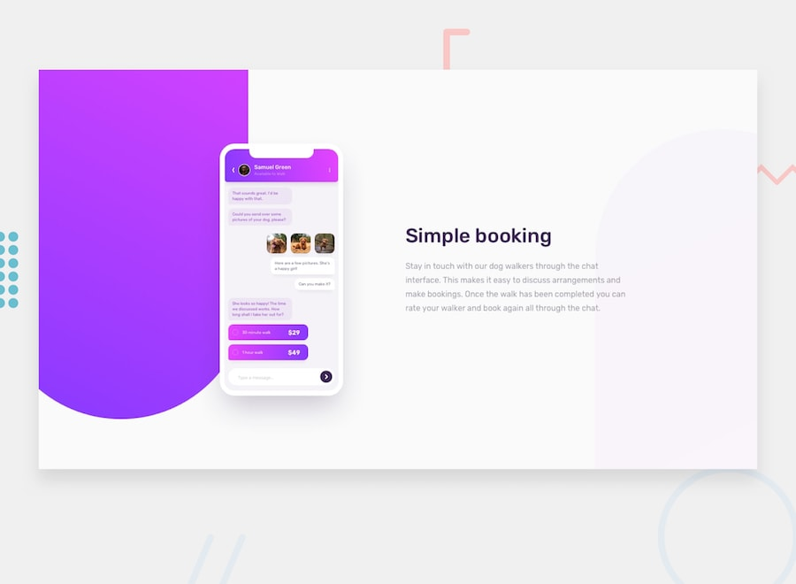

# Chat App CSS Illustration

   

This is my solution to the Frontend Mentor challenge "Chat app CSS illustration".

## Live Site
You can view the live project here:  
[Live Demo]()

## About the Project
I built a chat app interface for mobile using only HTML and CSS.  
The goal was to match the design as closely as possible and make it responsive.

## What I Built
- HTML5 for the structure
- CSS3 for styling and layout
- Flexbox for aligning elements
- CSS gradients for the background
- Mobile-first responsive design

## What I Learned
- How to create a phone mockup using CSS
- How to use Flexbox for complex layouts
- How to make curved backgrounds with CSS
- How to organize my CSS code in a separate file

## How to Run Locally
1. Download or clone this repository
2. Open `index.html` in your browser
3. Done!

## Useful Resources
- [Frontend Mentor](https://www.frontendmentor.io) - The challenge provider
- [MDN Web Docs](https://developer.mozilla.org) - For HTML and CSS reference

---

Built by Abdallah Yahya